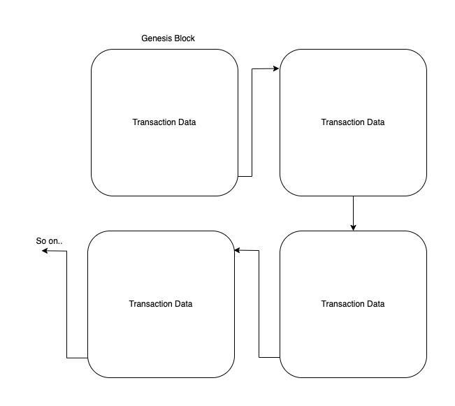
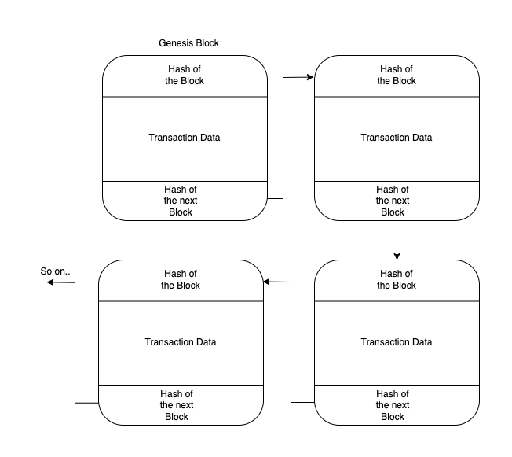

Based on our understanding now, we know that _a Blockchain is a distributed database storing transactions in blocks that are distributed in a P2P network._

Moving forward in this article, we will explore in-depth how these transactions are stored and how we ensure the transparency and security of these transactions.
To understand how things work in a better way, it is divided into subsections.

### What is a Block?

Within the blockchain, transactions are stored within blocks, you may consider a **block** as a storage for a group of transaction data including sender/receiver information, transaction amount information, etc, & _a chain of blocks is what we call a **blockchain**!_

As seen above, in the blockchain _(list of blocks)_, every block starting from the head block **(a.k.a genesis block)** is linked with the next block using a _pointer_. Hence, every block should have some space to save the details of the next block, isn't it? so that the list grows. This tells us that a block does not only store transaction details but also stores some other information too (regarding its structure?). Let's cover it under a new heading, below.

### What does a Block contain?

Every block in a blockchain has a **unique identification** or a hash that gets attached to it at the block creation time. Besides storing its hash, a block also stores the hash of the next block to be able to point to it.

Apart from uniquely identifying a block, the hash also serves as a **block tamper detection**. If any change is made to the existing transactions in a block, the hash of the corresponding block would also change. As an added feature, this change would also trigger a change in the hash of the next block! and the whole blockchain would be changed. When the entire blockchain of a node gets tampered with, it becomes easy to detect the faulty node since there are many nodes present in the p2p network.

Furthermore, there may exist a lot of other data within a blockchain node. But at the very minimum (for us to keep moving on!) what it contains is _its **hash**, **transaction data**, and a **hash of the next block** in the chain._

So a more correct representation of blockchain would be:

:::tip

A great simulation of blockchain is https://andersbrownworth.com/blockchain/blockchain where you can try to change the data within a block and see how the entire blockchain gets affected!

:::

### Where does a Block gets stored?

The list of blocks with all the transaction-related data gets stored in the format of a text file or a simple database on to the multiple distributed nodes in the network. Every node in the blockchain network (p2p) has a copy of this list or what we call a chain of blocks.

### How does the data get stored in a block/mining?

For simplicity terms, let's say that a new transaction creates or gets stored in a single block. So whenever a new transaction takes place, a new block should be appended to the blockchain. In reality, this is usually not the case. E.g., in a bitcoin network _(also a blockchain network but transactions are of bitcoin (digital tokens), later :P)_, a block stores over 2000 transactions and currently a new block gets appended after almost every 10 minutes!

So how does this entire process of transaction pushing to the blockchain network thing work?

Each transaction once created, should be added to a block and then pushed to the blockchain. Eventually, it should be one of the participating nodes within the p2p netowork that should do this task of pushing to the blockchain _but can any node push to the blockchain?_ **No**. There are dedicated nodes (**a.k.a miners**) in place who are responsible for appending the block in the blockchain.

_But how to decide which miner can push?_

Well, there is a competition that takes place amongst each miner and the winner gets to push the block into the distributed ledger. Isn't it amazing? The concept of putting the transaction into the blockchain. In turn, the winner miner also gets rewarded in terms of some (little) percentage of the transaction amount _(**a.k.a gas money**!:wink:)_

Once a new transaction block gets added to the blockchain, every node in the network gets synced up with the new block of transaction i.e. every node now has the new block which after validation gets added to the local database or ledger. and this is how the blockchain grows, with the help of every participant in the p2p network.

This _local ledger_ present in every node within the p2p network also gets coined as **Distributed Ledger**, and thus blockchain can also be termed as a **Distributed Ledger Technology**. Going forward we would be using this term to improve our definition of blockchain.

One thing to note is that there is no single chain of blocks present in the blockchain world! What makes blockchain secure and robust is the presence of the chain on all of the participating nodes thus also guaranteeing **transparency**!

Hope this gives an idea of how transactions are pushed into a blockchain network. Going forward you can also learn more about how transaction mining works in depth!
